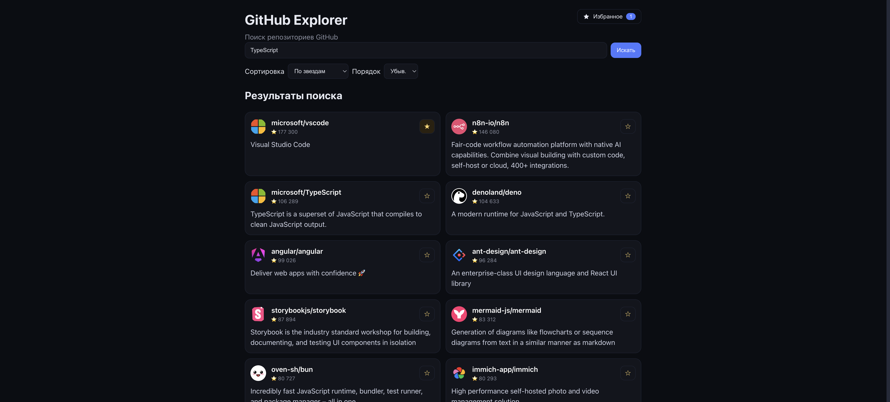

# GitHub Explorer

Поиск и просмотр репозиториев GitHub.  
Список → детали → добавление в избранное.



## ✨ Фичи

- Поиск репозиториев по запросу
- Детальная карточка репозитория (stars, forks, issues и т.д.)
- Избранное (локально, без бэкенда)
- Быстрый дев-сервер и сборка на Vite

## 🧱 Технологии

- **React + TypeScript + Vite**
- **Redux Toolkit**
- React Router
- ESLint

## 🚀 Быстрый старт

```bash
# 0) Требования
# Node.js 20.19+ или 22.12+

# 1) Установка
npm i
yarn install

# 2) Dev режим
npm run dev
yarn dev

# 3) Прод
npm run build
npm run preview

yarn build
yarn preview
```

##  ⚙️ Скрипты

```json
{
  "scripts": {
    "dev": "vite",
    "build": "tsc -b && vite build",
    "lint": "eslint .",
    "preview": "vite preview"
  }
}
```
